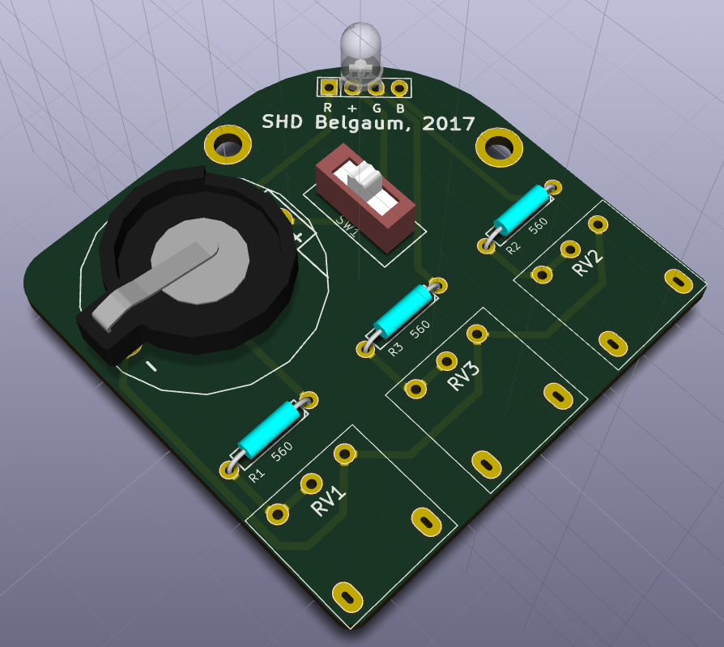
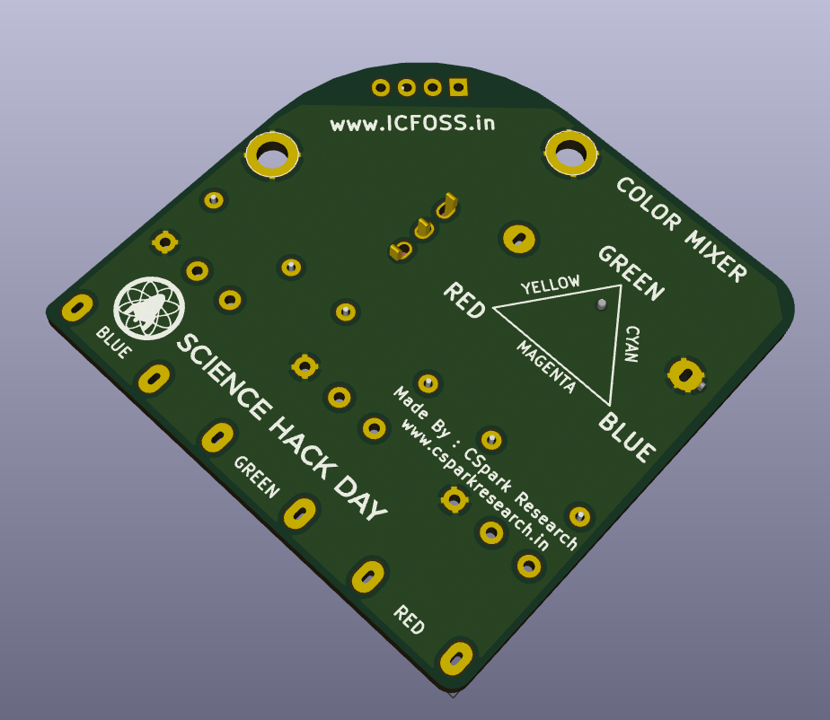

# Colour Mixer PCB

Top Side Screenshot |  Bottom Side Screenshot
 --------------------------- | ---------------------------------
    |  

This board was designed for Science Hack Day, Belgaum , 2017.

It consists of an LED with Red, Green, and Blue colours in a single package, a button cell, and some potentiometers to control the current flow through each junction.
By adjusting the current, and thereby the intensity of the emitted colour, various shades can be created.

It is intended as a tool to enhance soldering skills, as well as to learn some concepts of Physics.

Happy Hacking! :)

## Dependencies
+ [KiCad EDA](http://kicad-pcb.org/)

Rendered Gerber files are present in the `Gerber` directory

[License](./LICENSE.txt): GPLv3
